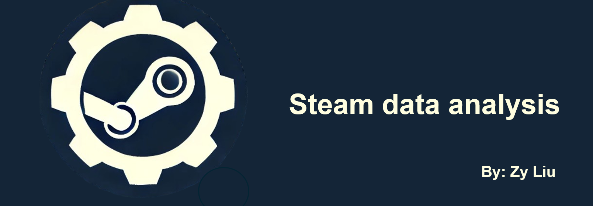
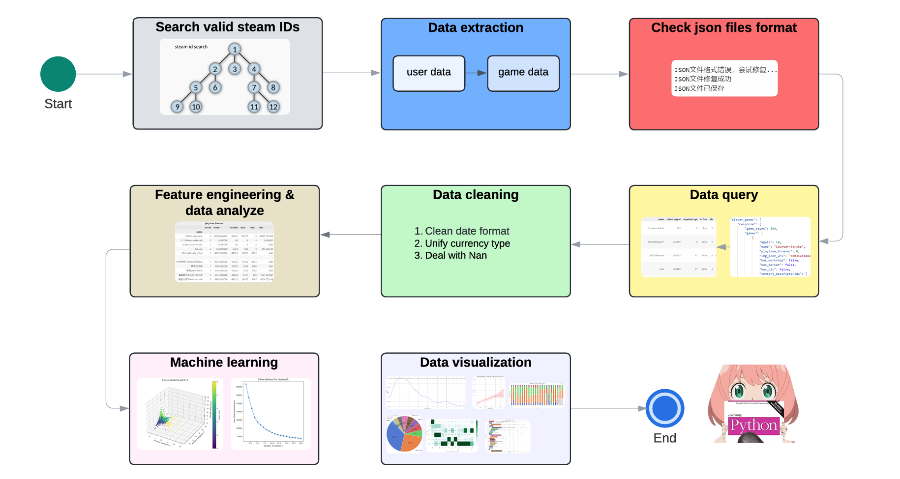

  
  
  

## 项目简介 🔬
本项目以宏观理解Steam游戏市场为目的，全面涵盖数据科学的多项技术栈：**数据挖掘、复杂数据查询、数据清洗、特征工程、数据分析、机器学习、数据可视化等**，来实现下列研究目标：
-   识别不同国家游戏市场偏好
-   分类不同的玩家群体
-   分析历史热门游戏以及当下热门游戏
-   识别不同类别游戏在市场的占比
-   分析游戏市场定价分布情况

此项目适合游戏市场行业相关工作者、游戏爱好者以及数据分析入门级工作者作为简单参考，通过此项目丰富对于游戏市场的认知，并系统性了解数据科学的完整工作流程，希望此项目能对您有所帮助 : ）

## 环境配置 🧶
- Steam API key 请点击[链接](https://steamcommunity.com/dev)获取
- SQL Server 19
- 基于Python：
    - Pandas：数据分析工具库
    - NumPy：支持大量的维度数组和矩阵运算
    - Matplotlib：绘图工具
    - Seaborn：基于Matplotlib的高级可视化库
    - scikit-learn：简单有效的机器学习库
    - asyncio：结构化网络编程工具
    - httpx：结构化网络编程工具，提供同步和异步请求功能

## 工作流程介绍 💻

0. **获取steam API key**：首先需要获得自己的密钥来进行数据抓取
1. **获取玩家ID**：由于并无公开的SteamID数据集，因此第一步需要抓取有效的玩家ID，请参考文件👉[【获取ID】](./src/1.%20data_extraction/extract_about_steam_ids/search_steamids.ipynb)
2. **获得玩家信息**：搜集上述玩家ID的各项相关信息，请参考文件👉[【获取玩家信息】](./src/1.%20data_extraction/extract_about_steam_ids/use_steam_api.ipynb)
3. **JSON修复**：使用JSONchecker脚本修复所抓取的数据，请使用文件👉[【JSON修复】](./src/3.%20data_cleaning/json_checker.ipynb) 
4. **数据提取**：
    - 4.1 **ID相关复杂数据提取**：使用pandas查询ID相关的JSON文件，请参考文件👉[【查询过程】](./src/2.%20data_query/Steam_id_query_process.ipynb)
    - 4.2 **获得游戏补充信息**：调用API抓取玩家所玩过的游戏的补充信息，请参考文件👉[【获取游戏补充信息】](./src/1.%20data_extraction/extract_about_steam_games/Steam_game_infomation_fetcher.ipynb)
    - 4.3 **JSON修复**：再次使用JSONchecker脚本修复所抓取的数据，请使用文件👉[【JSON修复】](./src/3.%20data_cleaning/json_checker.ipynb)
    - 4.4 **游戏数据提取**：使用pandas查询游戏相关的JSON文件，请参考文件👉[【查询过程】](./src/2.%20data_query/Steam_game_query_process.ipynb)
    - 4.5 **表格整理与合并**: 将“ID”与“游戏”相关的两个表格进行整理与合并，请参考文件👉[【表格合并】](./src/2.%20data_query/Steam_id_and_game_merge_process.ipynb)
5. **数据清洗**：解决各类型数据的格式问题，请参考文件👉[【数据清洗】](./src/3.%20data_cleaning/cleaning_process.ipynb)
6. **特征工程与数据分析**：分析数据并添加新参数，请参考文件👉[【分析过程】](./src/4.%20feature_enginering_and_data_analyze/analyze_process.ipynb)
7. **机器学习**: 使用PCA与K-means的组合进行无监督学习，将用户进行分类，请参考文件👉[【机器学习】](./src/5.machine_learning/unsupervise_learning_PCA_and_KMEANS_for_player_cluster.ipynb)
8. **数据可视化**：将最后整理好的所有数据，进行数据的可视化，请参考文件👉[【可视化】](./src/6.visualization/plots.ipynb)

## 推荐阅读的参考资料 🛠️
- Steam database https://steamdb.info/
- Steam Web API详细资料 https://steamcommunity.com/dev
- 开源项目SteamKit https://github.com/SteamRE/SteamKit
- 流程图制作工具 https://lucid.app